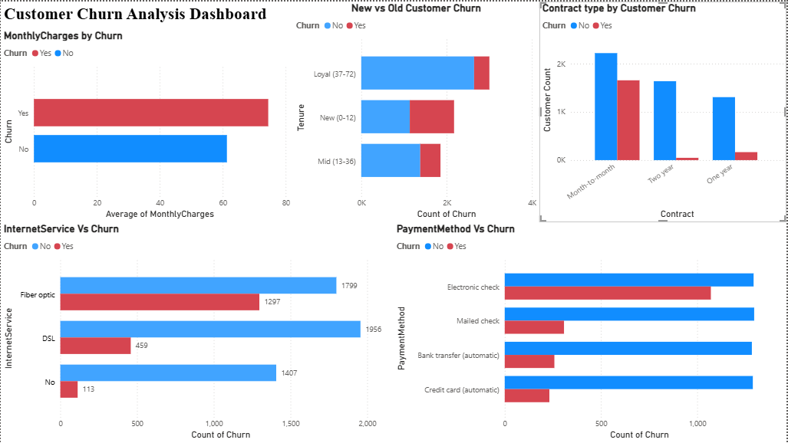

# Customer Churn Analysis 📊

## Project Overview
Analyzed 7,043 telecom customer records to identify 
key factors driving customer churn using Python and Power BI.

## Problem Statement
A telecom company is losing customers every month. 
This project identifies WHO is leaving, WHY they are 
leaving, and HOW to prevent it.

## Tools Used
- Python (Pandas, Numpy, Seaborn, Matplotlib)
- Google Colab
- Power BI

## Dataset
- Source: Kaggle — Telco Customer Churn
- Records: 7,043 customers
- Features: 21 columns

## Key Findings
- Month-to-month contracts have highest churn rate
- Customers paying higher monthly charges churn more
- New customers (0-12 months) churn more than loyal ones
- Fiber Optic internet service has highest churn
- Electronic check payment method has highest churn

## Dashboard

